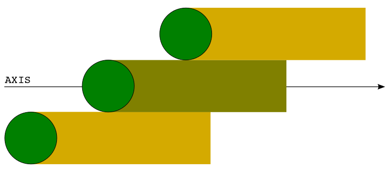
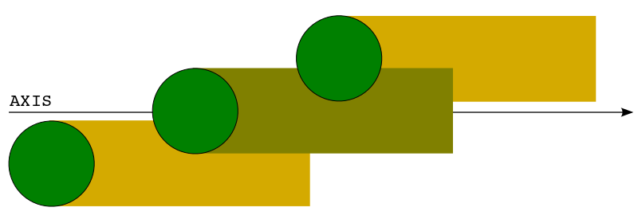

.. _configurations:

**********************************
Configurazione del DewarPositioner
**********************************

Il ``DewarPositioner`` ha cinque configurazioni:
:ref:`fixed <fixed>`,
:ref:`best space coverage <bsc>`, :ref:`optimized <optimized>`,
:ref:`aligned <aligned>` e :ref:`custom <custom>`.
Il comando ``derotatorSetConfiguration`` consente all'utente di impostare
(tramite *operator input*) la configurazione desiderata::

  derotatorSetConfiguration=FIXED # Imposta modalità fixed
  derotatorSetConfiguration=BSC # Imposta modalità best space coverage
  derotatorSetConfiguration=OPTIMIZED # Imposta modalità optimized
  derotatorSetConfiguration=ALIGNED # Imposta modalità aligned
  derotatorSetConfiguration=CUSTOM # Imposta modalità custom

.. note:: Quando viene impostata una configurazione la
   posizione del derotatore non viene modificata. L'aggiornamento della
   posizione può essere avviato, una volta che il ``DewarPositioner`` è
   configurato, solo dopo esplicita richiesta dell'utente o del programma.
   Nelle prossime sezioni mostreremo come fare.

Quando viene dato il comando ``derotatorSetConfiguration=CODE``, Nuraghe/ESCS
effettua la chiamata al metodo ``DewarPositioner.setConfiguration('CODE')``.
Se il codice non è valido viene sollevata una eccezione di tipo 
``ComponentError.ValidationErrorEx``::

    >>> setConfiguration('WRONGMODE') # Configurazione non valida
    Traceback (most recent call last):
    ...
    ValidationErrorEx: code WRONGMODE unknown

Vediamo ora nel dettaglio le varie configurazioni, suddividendole in
:ref:`statiche <statics>` e :ref:`dinamiche <dinamics>`.

.. _statics:

Configurazioni *statiche*
=========================
Nelle configurazioni statiche la posizione del derotatore non cambia al
variare della posizione dell'antenna o dell'asse di scansione.

.. _fixed:

Configurazione *fixed*
----------------------
In questa configurazione la posizione del derotatore viene mantenuta
fissa al variare della posizione dell'antenna, e questo è il motivo 
per cui le è stato assegnato il codice identificativo ``FIXED``. 

.. note:: Come abbiamo detto nella sezione :ref:`setup_actions`,
          la modalità *fixed* è quella che viene impostata di default
          dal *setup* del ``DewarPositioner``.

Abbiamo detto in precedenza che la configurazione del ``DewarPositioner`` non
aggiorna la posizione del derotatore, per cui se si vuole usare la modalità
fissa e aggiornare la posizione, allora da *operator input* bisogna 
usare in sequenza i comandi ``derotatorSetConfiguration`` e 
``derotatorSetPosition``. Ad esempio, se si volesse usare la modalità
*fixed* con posizione del derotatore a 30°::

    derotatorSetConfiguration=FIXED
    derotatorSetPosition=30

I due precedenti comandi eseguono la chiamata, rispettivamente, di::

    DewarPositioner.setConfiguration('FIXED')
    DewarPositioner.setPosition(30)

Esempio di utilizzo
~~~~~~~~~~~~~~~~~~~
Vediamo un esempio di sessione di lavoro con *operator input*::

    > derotatorSetConfiguration=FIXED
    > derotatorGetConfiguration
    FIXED
    > derotatorGetPosition
    50
    > derotatorSetPosition=10
    > derotatorGetPosition
    10

.. note:: Come possiamo vedere, se il derotatore si trova in 
   una certa posizione ``Px`` e viene impostata
   la modalità ``FIXED``, viene tenuta la posizione ``Px`` (il derotatore
   non viene riportato in posizione di zero) sinchè non viene comandata
   una nuova posizione con ``derotatorSetPosition``.

La stessa sessione di lavoro interattiva, utilizzando le API 
del ``DewarPositioner``, è la seguente::

    >>> DewarPositioner.setConfiguration('FIXED')
    >>> DewarPositioner.getConfiguration()
    FIXED
    >>> derotatorGetPosition
    >>> DewarPositioner.getPosition()
    50
    >>> DewarPositioner.setPosition(10)
    >>> DewarPositioner.getPosition()
    10

.. _dinamics:

Configurazioni dinamiche
========================
Nelle configurazioni statiche la posizione del derotatore non viene
aggiornata al variare della posizione dell'antenna o dell'asse
di scansione. Nelle configurazioni *dinamiche* invece 
il ``DewarPositioner`` aggiorna la posizione del derotatore in funzione
della posizione dell'antenna, al fine di compensare l'angolo parallatico
(o quello *paragalattico*, a seconda dell'asse di scansione). 

.. note:: L'asse di scansione, indicato con ``AXIS`` e
   definito come ``Managment::TScanAxis`` nella interfaccia IDL, può
   essere ``SIDEREAL``, ``GLON``, ``GLAT``, ``AZ``, ``EL``, ``RA``, ``DEC`` e
   ``GREATCIRCLE``

Nelle configurazioni dinamiche la posizione del derotatore è data
dalla seguente equazione::

    P = Pi + D(AZ, EL, AXIS)

dove ``Pi`` è una *posizione iniziale*, mentre ``D(AZ, EL, AXIS)``
è la cosidetta *funzione di derotazione*, che serve
per compensare l'angolo parallattico (o *paragalattico*).
Ciò che differenzia una configurazione
dinamica dall'altra è la posizione iniziale, mentre la 
funzione di derotazione non cambia, ed è data da:

    * ``D = 0`` quando ``AXIS`` è ``AZ`` o ``EL``
    * ``D = P(AZ, EL)`` quando ``AXIS`` è ``SIDEREAL``, ``RA``, ``DEC`` 
      o ``GREATCIRCLE``
    * ``D = G(AZ, EL)`` quando ``AXIS`` è ``GLON`` o ``GLAT``

dove ``P(AZ, EL)`` è la funzione di compensazione dell'angolo parallatico,
mentre ``G(AZ, EL)`` è quella di compensazione dell'angolo *paragalattico*.

Come per le configurazioni statiche, anche per quelle dinamiche 
l'impostazione della configurazione non causa l'aggiornamento della posizione,
visto che non è ancora noto l'asse di scansione. L'aggiornamento avviene quindi
solamente dopo che viene chiamato il metodo ``DewarPositioner.startUpdating()``,
il quale prende come argomento un dato asse. Ad esempio::

    >>> from Management import MNG_SIDEREAL
    >>> DewarPositioner.setConfiguration('BSC') # Non aggiorna la posizione
    >>> DewarPositioner.startUpdating(MNG_SIDEREAL) # Avvia l'aggiornamento della posizione

La chiamata a questi metodi viene eseguita in modo automatico da Nuraghe/ESCS, e 
non può essere fatta manualmente dall'astronomo tramite *operator input*.

.. _bsc:

Configurazione *best space coverage*
------------------------------------
Nella configurazione *best space coverage*, che identificheremo con
il codice ``BSC``, i feed vengono disposti in modo tale da 
avere la miglior copertura spaziale della sorgente durante la scansione
lungo un dato asse. Un esempio di scan in configurazione ``BSC``
è illustrato in figura 1.

   Figura 1: Feed disposti in modo da avere la migliore copertura spaziale.

La configurazione ``BSC`` garantisce che durante la scansione
non si verifichi il caso mostrato in figura 2, nel quale
l'area osservata da ciascun feed è in parte coperta anche da un altro feed,
e nemmeno il caso opposto in cui vi è un gap tra le zone coperte dai feed.

   Figura 2: Le aree coperte dai feed si sovrappongono

Quando questa configurazione è attiva, il sistema prima posiziona il derotatore
in una posizione iniziale che indicheremo con ``Pis`` (il pedice *i* sta per
*initial*, mentre il secondo pedice indica il tipo di
configurazione, e in questo caso significa *space*),
dopodiché aggiunge a ``Pis`` il contributo alla *derotazione* (che indicheremo
con ``D``) dovuto alla
compensazione dell'angolo parallatico o di quello *paragalattico*, a seconda
dell'asse di scansione scelto. 

La posizione del derotatore, che in questa configurazione indichiamo 
con ``Ps``, è quindi data dalla seguente equazione:

.. code-block:: none

   Ps = Pis(AXIS) + D(AZ, EL, AXIS) # BSC (Best Space Coverage)

.. note:: Per un dato derotatore, il valore della posizione iniziale ``Pi`` 
          viene letto da una tabella di configurazione e
          dipende dall'asse di scansione, per cui abbiamo utilizzato
          la notazione ``Pi(AXIS)`` per indicare che ``Pi`` è funzione 
          dell'asse. Allo stesso modo, la funzione di compensazione
          dell'angolo (parallatico o *paragalattico*) dipende dai 
          valori dell'azimuth, dell'elevazione e dell'asse di scansione,
          per cui la abbiamo indicata con ``D(AZ, EL, AXIS)``.

La modalità ``BSC`` non consente
l'utilizzo del metodo ``DewarPositioner.setPosition()``, e quindi
neppure quello del corrispondente comando. Nel caso lo si chiami,
questo solleva una eccezione::

    >>> DewarPositioner.getConfiguration() 
    'BSC'
    >>> DewarPositioner.setPosition(30) 
    Traceback (most recent call last):
    ...
    NotAllowedEx: BSC does not allow to change the position

In questa modalità il set di feed posizionati in modo da garantire la
massima copertura spaziale sono stabilti a priori (ad esempio per il
banda K sono i feed 1, 0 e 4), e questo significa che la configurazione
``BSC`` non è ottimizzata per garantire la massima escursione del derotatore.

Esempio di utilizzo
~~~~~~~~~~~~~~~~~~~
Per utilizzare questa modalità, l'osservatore non deve far altro che
dare da *operator input* il comando::

    > derotatorSetConfiguration=BSC 

Come possiamo vedere, non viene eseguito alcun comando di aggiornamento della
posizione, perchè questo è compito di Nuraghe/ESCS, il quale chiama i
seguenti metodi::

    >>> DewarPositioner.setConfiguration('BSC')
    >>> DewarPositioner.startUpdating(AXIS) # Chiamato ad avvio scansione lungo AXIS

.. _optimized:

Configurazione *optimized*
--------------------------
La configurazione *optimized*, identificata con il codice ``OPTIMIZED``,
è analoga alla :ref:`best space coverage <bsc>` ma a differenza di
quest'ultima, all'inizio di ogni scan la posizione del derotatore
viene calcolata oltre che per ottenere la massima copertura spaziale del
multifeed lungo l'asse di scansione, anche per massimizzare
la durata dello scan prima che si renda necessario riavvolgere, per cui
la posizione iniziale va scelta in modo che il set di feed garantisca
la massima copertura spaziale durante lo scan, e che sia tale da
essere la più vicina possibile a uno dei fine corsa del derotatore (quello
dal quale ci si allontana durante lo scan).
In questo caso la posizione da comandare è data da::

    Po = Pio(SECTOR, AXIS) + D(AZ, EL, AXIS) 
    
dove ``SECTOR`` può essere ``NORD`` o ``SUD``, mentre ``Pio`` è dato da::

    Pio(SECTOR) = K(SECTOR) + Pis(AXIS) 

Il parametro ``K`` viene sommato a ``Pis`` in modo da ottenere una 
posizione iniziale ``Pio`` che garantisca la massima copertura spaziale
durante lo scan, e
tale che si abbia la massima durata dello scan prima che sia necessario
riavvolgere. Il valore di ``K``, in modulo, è dato da::

    abs(K) = NUMBER_OF_FEEDS*STEP

dove ``NUMBER_OF_FEEDS`` è la nostra incognita, e rappresenta il numero di 
feed di cui dobbiamo ruotare il derotatore per garantire la massima escursione
durante lo scan. Vediamo come calcolarlo, con un esempio.
Supponiamo di utilizzare il derotatore del
22GHz di SRT, la cui posizione può andare da -106 a +106 gradi, e il cui ``STEP``
è pari a 60 gradi. Dobbiamo iniziare una scansione con ``AXIS == GLON``, 
e supponiamo che da tabella si abbia ``Pis = 40 gradi``.
Supponiamo infine che durante la scansione l'azimuth sia tale per cui
l'antenna punterà a nord, per cui il cielo ruoterà CCW. 
Il derotatore ruoterà anche esso CCW, per cui dobbiamo sceglere il 
valore di ``NUMBER_OF_FEEDS`` che
garantisca la massima escursione, ovvero tale che 
``Pis + NUBER_OF_FEEDS*STEP`` sia il più vicino possibile al 
limite positivo +106 gradi, ma non lo superi. Questo valore
è ``NUMBER_OF_FEEDS = 1``, visto che si ha:

.. code-block:: none

    Pis + NUMBER_OF_FEEDS*STEPS == 40 + NUMBER_OF_FEEDS*60 < 106

ovvero:

.. code-block:: none
    
    NUMBER_OF_FEEDS < (106-40)/60  --> NUMBER_OF_FEEDS = 1

Quindi in questo caso ``K = NUMBER_OF_FEEDS*STEP = 60 gradi``.
Per quanto riguarda il segno di ``K``, questo cambia a seconda che
``SECTOR`` sia ``NORD`` o ``SUD``:

  * ``NORD``: il cielo ruota CCW per cui ``SGN(K) == +1``
  * ``SUD``: il cielo ruota CW, per cui ``SGN(K) == -1``

Ad esempio, consideriamo l'esempio di prima, con ``Pis = 40 gradi`` e
con l'antenna che osserva a *sud*, ovvero rotazione CW. In questo caso si
ha ``NUMBER_OF_FEEDS = 2``:

.. code-block:: none

    40 - NUMBER_OF_FEEDS*60 > -106  -->  NUMBER_OF_FEEDS < 146/60 

per cui:

.. code-block:: none

    K = -NUMBER_OF_FEEDS*STEP = -2*60 = -120

Quindi, riassumendo, se l'antenna osserva a sud::

    Po = Psi(AXIS) - NUMBER_OF_FEEDS*STEP + D(AZ, EL, AXIS) 

mentre se l'antenna sta osservando a nord::

    Po = Psi(AXIS) + NUMBER_OF_FEEDS*STEP + D(AZ, EL, AXIS)

Il valore di ``Poi`` viene calcolato dal ``DewarPositioner`` a *runtime*,
ricavando prima il
valore di ``Psi`` da tabella e poi calcolando ``K(SECTOR)``.
Concludiamo dicendo che così come per la configurazione ``BSC``, anche
la ``OPTIMIZED`` non consente l'utilizzo del comando ``derotatorSetPosition``.

Esempio di utilizzo
~~~~~~~~~~~~~~~~~~~
Anche qua, per quanto riguarda l'aggiornamento della posizione, ci si comporta
allo stesso modo di quanto abbiamo visto al termine della sezione
:ref:`bsc`, per cui da *operator input* è sufficiente dare il comando::

    > derotatorSetConfiguration=OPTIMIZED

.. _aligned:

Configurazione *aligned*
------------------------
In questa configurazione, il cui codice identificativo è ``ALIGNED``,
viene scelto il set di feed che si vuole allineare con l'asse di scansione.
In Nuraghe/ESCS vi sarà una tabella che riporterà, per ogni derotatore,
i possibili set. La posizione del derotatore è data da::

   Pa = Pia(AXIS) + D(AZ, EL, AXIS) 

.. attention:: Se il derotatore non compre un angolo di almento 360°, non
   è detto che sia possibile allineare un certo set di feed con un dato
   asse. In generale però se non è possibile allinearli con un asse, è 
   probabile che li si possa allineare con quello ortogonale.

Esempio di utilizzo
~~~~~~~~~~~~~~~~~~~
Rispetto alle altre configurazioni dinamiche, nella configurazione *aligned*
vi è un ulteriore comando da utilizzare, chiamato ``derotatorSetAlignment``,
che prende come argomento una stringa identificativa dei feed che si 
vuole allineare.
Nella stringa i feed devono essere separati da un segno meno::

    > derotatorSetConfiguration=ALIGNED
    > derotatorSetAlignment=0-4

In questo caso viene scelto il set a cui appartengono
i feed 0 e 4 (ad esempio, nel caso del banda K verrebbe scelto il set ``{1, 0, 4}``).

.. important:: Se non viene scelto un allineamento, allora viene utilizzato
   un allineamento di default (nel caso del banda K è quello ``{1, 0, 4}``).

Il comando ``derotatorSetConfiguration=ALIGNED`` da luogo alla chiamata
dei seguenti metodi::

    DewarPositioner.setConfiguration('ALIGNED') # Non avvia aggiornamento posizione
    DewarPositioner.setAlignment('default') # Non avvia aggiornamento posizione
    DewarPositioner.startUpdating(AXIS) # Chiamato quando viene avviato lo scan

La sessione di *operator input* riportata all'inizio di questa sezione da
invece luogo alle seguenti chiamate::

    DewarPositioner.setConfiguration('ALIGNED') 
    DewarPositioner.setAlignment('default') 
    DewarPositioner.setAlignment('0-4') 
    DewarPositioner.startUpdating(AXIS) # Chiamato quando viene avviato lo scan

Concludiamo dicendo che così come per la configurazione ``BSC`` e ``OPTIMIZED``, 
anche la ``ALIGNED`` non consente l'utilizzo del comando ``derotatorSetPosition``.

.. _custom:

Configurazione *custom*
-----------------------
In questa configurazione la posizione iniziale può essere impostata 
dall'utente, e per tale motivo a questa configurazione è stato assegnato
il codice identificativo ``CUSTOM``. La posizione del derotatore è data da::

   Pc = Pic + D(AZ, EL, AXIS) 

Esempio di utilizzo
~~~~~~~~~~~~~~~~~~~
Rispetto ai casi di configurazione dinamica appena visti, nella modalità
*custom* è necessario specificare la posizione iniziale, altrimenti
verrà utilizzata come ``Pic`` la posizione attuale. Ad esempio, se
si vuole avere una posizione iniziale di 30°::

    > derotatorSetConfiguration=CUSTOM
    > derotatorSetPosition=30

Come al solito l'aggiornamento viene avviato da Nuraghe/ESCS nel momento
in cui viene comandata la scansione lundo un dato asse.

Interrompere l'aggiornamento
----------------------------
Dal punto di vista di Nuraghe/ESCS, se si vuole interrompere 
l'aggiornamento della posizione del derotatore 
bisogna chiamare il metodo ``DewarPositioner.stopUpdating()``.

L'astronomo invece può interrompere l'aggiornamento in due modi:

  1. passando alla configurazione :ref:`fixed <fixed>`, e in questo
     caso il derotatore si fermerà all'ultima posizione comandata
  2. utilizzando il comando ``derotatorStopUpdating``

.. attention:: Nota personale: per passare da una modalità all'altra è necessario
   uno ``stopUpdating()``? In questo caso 
   nel ``DewarPositionerImpl.setConfiguration()``,
   devo inserire delle procedure
   in modo che venga chiamato lo ``stopUpdating()``.

Concludiamo dicendo che oltre ai comandi visti in questa sezione, ve ne
sono altri legati alle configurazioni, come ``derotatorGetConfiguration``,
``derotatorIsConfigured``, ecc. Per un elenco completo dei comandi
si veda la sezione :ref:`commands`, mentre l'elenco completo dei metodi
è riportato nella sezione :ref:`api`.

